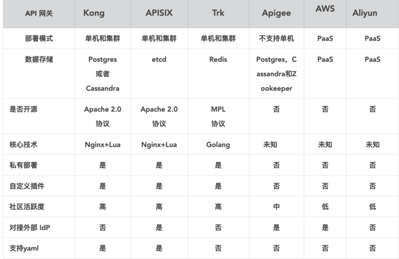

## API 网关

> API Gateway 

### 目录
* [API网关的定义](#API网关的定义)
* [API网关的应用场景](#API网关的应用场景)
* [API网关的基本功能](#API网关的基本功能)
* [常见的API网关](#常见的API网关)
* [API网关对比](#API网关对比)

### API网关的定义
API网关（API Gataway） 字面意思是指将所有API的调用统一接入API网关层，由网关层负责接入和输出。

API网关是一个各类不同API的前置服务器。API网关封装了系统内部架构，对外提供统一服务。此外还可以实现一些附加功能，如身份验证、监控、负载均衡、缓存、报文转换等。

### API网关的应用场景
微服务

API网关 更专注于安全、流量、路由等问题。

### API网关的基本功能
* 统一接入

    首要的功能是负责统一接入，高性能、高并发、高可用、负载均衡...

* 协议适配

    HTTP/Dubbo/JSF

* 流量管理与容错

    限流、降级和熔断

* 安全防护

    防刷控制、黑白名单

### 常见的API网关
* [Zuul](../Component/Zuul.md) Zuul是Spring Cloud全家桶中的微服务API网关。
* [Spring Cloud Gateway](../Component/Spring/Spring-Cloud/Spring-Cloud-Gateway.md) 被视为Spring Cloud Netflix Zuul项目的后续产品
* [Kong](../Component/Kong.md)
* [OpenResty](../Component/OpenResty.md) 通过 Lua 扩展 NGINX 实现的可伸缩的 Web 平台
* [APISIX](../Component/APISIX.md) 国产微服务网关
* [Tyk](../Component/Tyk.md) 轻量级API网关，不支持RPC
* [Apigee](../Component/Apigee.md) Google，国内不能访问

### API网关对比

开源网关的对比分析

<table>
  <tr><th>网关</th><th>限流</th><th>鉴权</th><th>监控</th><th>易用性</th><th>可维护性</th><th>成熟度</th><th>GitHub star(20191206)</th></tr>
  <tr><td>Spring Cloud Gateway</td><td>可以通过IP、用户、集群限流，提供了相应的接口进口扩展</td><td>普通鉴权、auth2.0</td><td>Gateway Metrics Filter</td><td>简单易用</td><td>Spring Cloud全家桶，可维护性好</td><td>成熟</td><td>star: 2k</td></tr>
  <tr><td>Zuul 2.x</td><td>配置集群限流和单服务器限流，通过filter扩展限流</td><td>Filter</td><td>Filter</td><td>易用性较差，资料较少</td><td>可维护性较差</td><td>不太成熟</td><td>star: 8.6</td></tr>
  <tr><td>OpenResty</td><td>需要开发</td><td>需要开发</td><td>需要开发</td><td>简单易用，但是需要lua开发的很多</td><td>可维护性较差，需要维护lua脚本</td><td>成熟</td><td>star: 7.8k</td></tr>
  <tr><td>Kong</td><td>根据秒、分、时、天、月、年，根据用户进行限流。可以在源码基础上进行开发</td><td>普通鉴权，Key Auth鉴权，HMAC，Auth2.0</td><td>可上报datadog，记录请求数量，请求数据量，应答数据量，接受与发送的时间间隔，状态码数量，kong内运行时间</td><td>简单易用，api转发通过管理员接口配置，开发需要lua脚本</td><td>可维护性较差，需要维护lua库</td><td>相对成熟，用户问题汇总，社区，插件开源</td><td>star: 24.2k</td></tr>
</table>