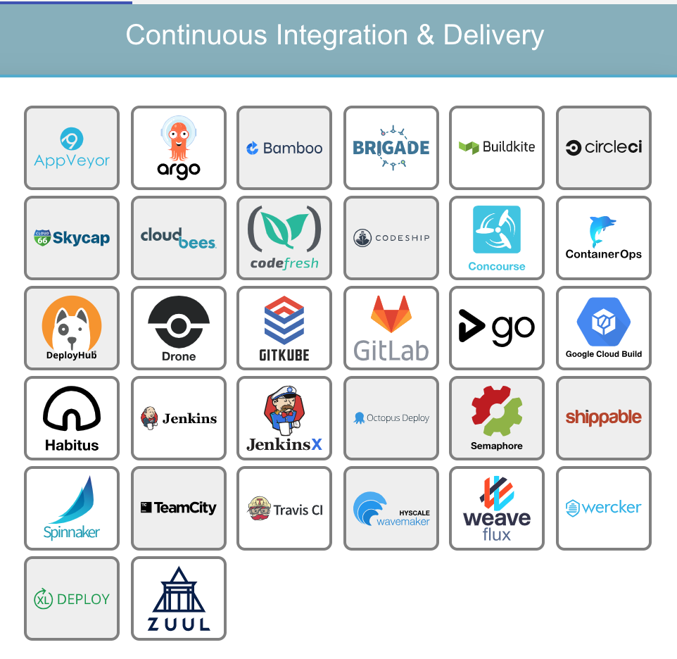

## CI/CD

> 持续集成，持续交付，持续部署
>
> 容器平台自动化 CI/CD 流水线

### 目录
* [CI/CD是什么？](#CI/CD是什么？)
* [CI/CD的作用和好处](#CI/CD的作用和好处)
* [案例、工具](#案例)
* [参考](#参考)

### CI/CD是什么？
* CI (Continuous Integration) 持续集成。重点是将各个开发人员的工作集合到一个代码仓库中
* CD (Continuous Delivery) 持续交付。目的是最小化部署或释放过程中固有的摩擦。交付流程自动化。
* CD (Continuous Deployment) 持续部署。自动化部署。

随着DevOps的兴起，出现了持续集成、持续交付、持续部署的新方法。

### CI/CD的作用和好处
CI/CD的采用改变了开发人员和测试人员如何发布软件。

* CI (Continuous Integration) 持续集成。

    通过持续集成，开发人员能够频繁将其代码集成到公共代码仓库的主分支中。
    
    CI 的目标是将集成简化成一个简单、易于重复的日常开发任务，这将有助于降低总体构建成本，并在周期的早期发现缺陷。要想有效地使用 CI 必须转变开发团队的习惯，要鼓励频繁迭代构建，并且在发现 bug 的早期积极解决。
    
* CD (Continuous Delivery) 持续交付。

    实际上是 CI 的扩展，软件交付流程进一步自动化，以便随时轻松地部署到生成环境中。CD 集中依赖于部署流水线，团队通过流水线自动化测试和部署过程。
    
* CD (Continuous Deployment) 持续部署。

    持续部署扩展了持续交付，以便软件构建，在通过所有测试时自动部署。

### 案例
* [GitLab CI](../Component/GitLab-CI.md)
* [GoCD](../Component/GoCD.md)
* [Travis CI](../Component/Travis-Ci.md)
* [Jenkins](../Component/Jenkins.md) 最受欢迎的自动化工具。
* [Concourse CI](../Component/Concourse-CI.md)
* [Spinnaker](../Component/Spinnaker.md)
* [Screwdriver](../Component/Screwdriver.md)
* [AWS](../Component/AWS.md)上提供了现代CI/CD管道的可靠展示。

### 参考
* https://blog.csdn.net/weixin_44903147/article/details/96291588
* https://www.jianshu.com/p/8efa63e32cfb