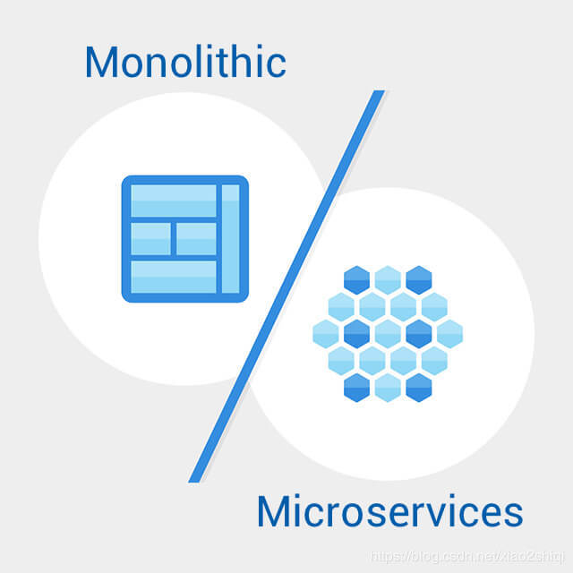

## MicroServices Architecture

> 微服务架构
>

### 目录
* [微服务是什么？](#微服务是什么？)
* [为什么要用微服务？](#为什么要用微服务？)
* [微服务有什么特点？](#微服务有什么特点？)
* [微服务落地有什么问题？](#微服务落地有什么问题？)
* [微服务落地的改进方案](#微服务落地的方案)
* [微服务架构与SOA对比](SOA.md#SOA-vs-MicroServices)
* [参考](#参考)

### 微服务是什么？
微服务是以专注于单一责任与功能的小型功能区块为基础，利用模组化的方式组合出复杂的大型应用程序，各功能区块使用与语言无关的 API（例如 REST）集相互通讯，且每个服务可以被单独部署。

微服务倡导将复杂的单体应用拆分为若干个功能简单、松耦合的服务，这样可以降低开发难度、增强扩展性、便于敏捷开发。

微服务架构是SOA的进一步发展。

微服务架构的系统是一个分布式的系统，将应用按业务进行划分为独立的服务单元，解决单体系统的不足，同时也满足越来越复杂的业务需求。每个微服务仅关注于完成一件任务并很好地完成该任务。

### 为什么要用微服务？
单体应用（传统的 Servlet + JSP 或 SSM 或 SpringBoot）比较容易部署，测试，整体性强，但是单体应用有以下弊端： 
1. 部署成本高，修改少量的代码也需要重新编译更新；
2. 复杂性高，修改代码影响大，风险高；
3. 部署频率低；
4. 扩展能力有限，无法满足快速扩容，弹性伸缩。

以上的问题使我们要将应用转向微服务架构，也是微服务架构需要解决的问题。

### 微服务有什么特点？
1. 解耦
2. 组件化，组件自治
3. 去中心化
4. 职责明确，各司其职
5. 灵活发布，独立部署
6. 错误隔离
7. 快速扩容，弹性伸缩
8. 微服务大多以集群的方式进行部署。
9. 混合技术栈

微服务在解决了快速响应和弹性伸缩后，又带来了什么问题？有什么解决方案？

### 微服务落地有什么问题？
1. 单体应用拆分为分布式系统后，进程间的通讯机制和故障处理措施变的更加复杂。[服务发现](#1.-服务发现)
2. 系统微服务化后，一个看似简单的功能，内部可能需要调用多个服务并操作多个数据库实现，服务调用的分布式事务问题变的非常突出。[分布式事务](#2.-分布式事务)
3. 微服务数量众多，其测试、部署、监控、集群的资源管理等都变的更加困难。[虚拟化技术](#3.-虚拟化技术) [自动化部署](#4.-CI/CD和自动化部署) [监控](#5.-监控) [资源管理](#6.-资源管理)
4. 微服务之间有着错综复杂的依赖关系，服务往往不是百分之百可靠，可能会出现错误或延迟。 那么就需要对可能出现的故障进行容错和隔离，否则就会应用可能被故障拖垮瘫痪。[容错](#7.-容错)
5. [CAP原则](CAP-Principle.md)相关问题。Consistency（一致性）、 Availability（可用性）、Partition tolerance（分区容错性）

### 微服务落地的方案

##### 1. 服务发现
RPC框架 Dubbo，RESTful，注册中心Consul/Eureka/Zookeeper。

服务拆分（“高内聚，低耦合”的基本原则），服务间的依赖，内部接口规范，数据传递

##### 2. 分布式事务
阿里巴巴提出的分布式事务解决方案GTS

##### 3. 虚拟化技术
Docker

##### 4. CI/CD和自动化部署
[CI/CD](CICD.md)是什么？

Kubernetes

##### 5. 监控
日志聚合，全链路监控（高度可观察和分析诊断问题）

Spring Cloud 监控组件

Prometheus

##### 6. 资源管理
Apache MESOS 
Docker SWARM
Kubernetes

##### 7. 容错
断路器

##### 8. 负载均衡

### 参考
* `https://www.cnblogs.com/jiangyu666/p/8522547.html`

