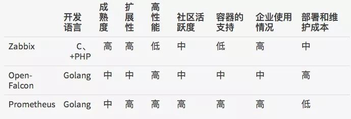

## Monitoring

监控

### 目录
* [什么是监控？](#什么是监控？)
* [监控一般都提供哪些功能？](#监控一般都提供哪些功能？)
* [有哪些监控组件？](#有哪些监控组件？)
* [监控组件对比](#监控组件对比)
* [参考](#参考)

### 什么是监控？
微服务架构下，服务按照不同的维度进行拆分，一次请求请求往往需要涉及到多个服务。互联网应用构建在不同的软件模块集上，这些软件模块，有可能是由不同的团队开发、可能使用不同的编程语言来实现、有可能布在了几千台服务器，横跨多个不同的数据中心。因此，就需要一些可以帮助理解系统行为、用于分析性能问题的工具，以便发生故障的时候，能够快速定位和解决问题。

分布式调用链监控组件在这样的环境下产生了。

### 监控一般都提供哪些功能？
提前预警、问题排查、评估决策等

* 数据收集。
* 数据加工。
* 特称提取。
* 数据展示。

### 有哪些监控组件？
* [Zabbix](../Component/Zabbix.md) 企业级开源监控解决方案。
* [Prometheus](../Component/Prometheus.md) 监测系统和时间序列数据库
* [Nagios](../Component/Nagios.md) 网络监视工具
* [Open-Falcon](../Component/Open-Falcon.md) 运维监控系统

### 监控组件对比
Zabbix、Open-Falcon、Prometheus 对比

从开发语言上看，为了应对高并发和快速迭代的需求，监控系统的开发语言已经慢慢从C语言转移到Go。不得不说，Go凭借简洁的语法和优雅的并发，在Java占据业务开发，C占领底层开发的情况下，准确定位中间件开发需求，在当前开源中间件产品中被广泛应用。

从系统成熟度上看，Zabbix是老牌的监控系统：Zabbix是在1998年出现的，系统功能比较稳定，成熟度较高。而Prometheus和Open-Falcon都是最近几年才诞生的，虽然功能还在不断迭代更新，但站在巨人的肩膀之上，在架构设计上借鉴了很多老牌监控系统的经验。

从系统扩展性方面看，Zabbix和Open-Falcon都可以自定义各种监控脚本，并且Zabbix不仅可以做到主动推送，还可以做到被动拉取，Prometheus则定义了一套监控数据规范，并通过各种exporter扩展系统采集能力。

从数据存储方面来看，Zabbix采用关系数据库保存，这极大限制了Zabbix采集的性能，Open-Falcon采用RDD数据存储，并且可以对接到OpenTSDB，而Prometheus自研一套高性能的时序数据库，在V3版本可以达到每秒千万级别的数据存储，通过对接第三方时序数据库扩展历史数据的存储。

从配置和维护的复杂度上看，Prometheus只有一个核心server组件，一条命令便可以启动，相比而言，其他系统配置相对麻烦，尤其是Open-Falcon。

从社区活跃度上看，目前Zabbix社区活跃度比较低，Open-Falcon虽然也比较活跃，但基本都是国内的公司参与，Prometheus在这方面占据绝对优势，社区活跃度最高，并且受到CNCF的支持，后期的发展值得期待。

从容器支持角度看，由于Zabbix出现得比较早，当时容器还没有诞生，自然对容器的支持也比较差。Open-Falcon虽然提供了容器的监控，但支持力度有限。Prometheus的动态发现机制，不仅可以支持Swarm原生集群，还支持Kubernetes容器集群的监控，是目前容器监控最好解决方案。Zabbix在传统监控系统中，尤其是在服务器相关监控方面，占据绝对优势。伴随着容器的发展，Prometheus开始成为主导及容器监控方面的标配，并且在未来可见的时间内被广泛应用。总体来说，对比各种监控系统的优劣，Prometheus可以说是目前监控领域最锋利的“瑞士军刀”了。

### 参考
* `http://www.sohu.com/a/342733264_198222`
* `https://www.jianshu.com/p/7f6654657417`