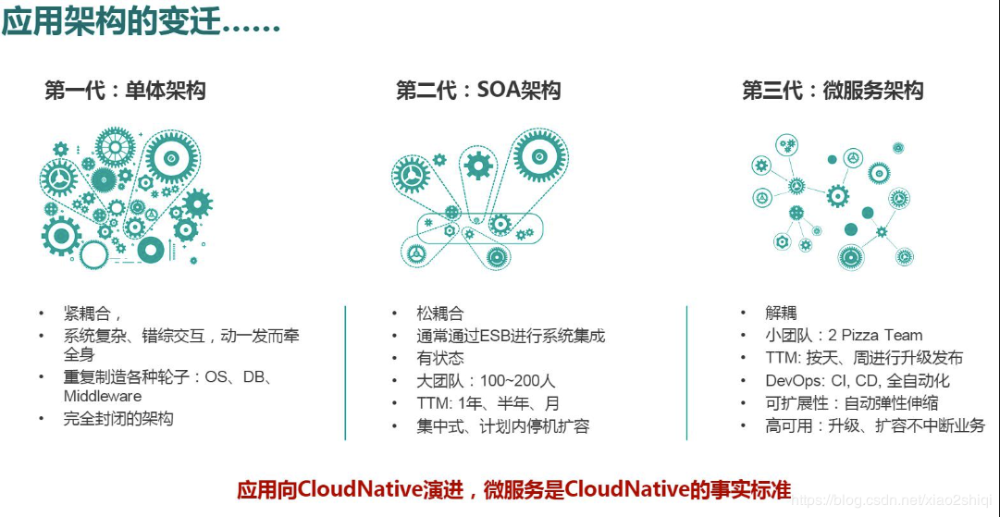

## SOA

> Service Oriented Architecture 面向服务架构 简写SOA

### 目录
* [SOA是什么？](#SOA是什么？)
* [SOA与微服务对比](#SOA-vs-MicroServices)
* [应用架构的变迁](#应用架构的变迁)
* [参考](#参考)

### SOA是什么？
面向服务的架构（SOA）是一个组件模型，它将应用程序的不同功能单元（称为服务）进行拆分，并通过这些服务之间定义良好的接口和协议联系起来。

SOA是一种粗粒度、松耦合服务架构，服务之间通过简单、精确定义接口进行通讯，不涉及底层编程接口和通讯模型。

### SOA vs MicroServices
面向服务架构（SOA）与微服务架构对比？

面向服务的架构（SOA）是一个组件模型，它将应用程序的不同功能单元（称为服务）进行拆分，并通过这些服务之间定义良好的接口和协议联系起来。SOA是一种粗粒度、松耦合服务架构，服务之间通过简单、精确定义接口进行通讯，不涉及底层编程接口和通讯模型。

微服务，强调“业务需要彻底的组件化和服务化”

微服务架构是SOA的进一步发展，也可以把SOA看做是微服务的超群。微服务架构 = 80%的SOA服务架构思想 + 100%的组件化架构思想 + 80%的领域建模思想。 

SOA的特征/特性：
1. 系统服务化，业务服务化
2. 鼓励组件共享。粗粒度、松耦合。
3. 每个团队都需要了解常见的通信机制，了解业务对整个系统的影响
4. 中央管理，共享数据存储，共同的治理和标准
5. 使用通用平台进行部署

微服务的特征：
1. 通过服务实现组件化
2. 微服务尝试通过“上下文边界”来最小化共享。 细粒度、总是松耦合
3. 按业务能力来划分服务和团队
4. 去中心化
5. 基础设施自动化（自动部署等）

### 应用架构的变迁
单体架构 -> SOA架构 -> 微服务架构

### 参考
* `https://blog.csdn.net/zpoison/article/details/80729052`
* `https://www.cnblogs.com/xiao2shiqi/p/11298663.html`