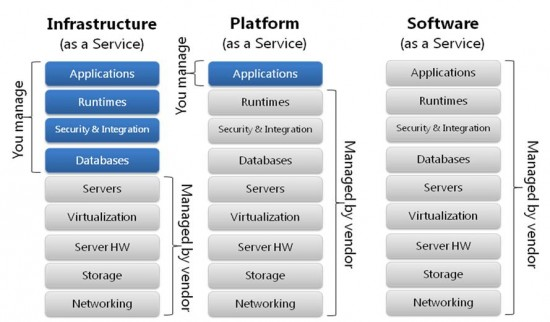

## 云计算的三种服务模型

> 美国政府为云计算定义了三种服务模型：软件形式的服务模型(SaaS), 平台形式的服务模式 PaaS 和基础设施形式的服务模式(IaaS).

### 目录
* [三种服务模型](#三种服务模型)
* [三种服务模型实例](#三种服务模型实例)

### 三种服务模型
云服务可以分为三大类：IaaS，PaaS，SaaS。

* IaaS：基础设施服务，Infrastructure-as-a-service
* PaaS：平台服务，Platform-as-a-service
* SaaS：软件服务，Software-as-a-service

对应软件开发：

### 三种服务模型实例
* IaaS 基础设施服务
    
    国内： 代表厂商阿里云
    
    国际： 代表厂商 IWS 

* Paas 平台即服务
    
    国内： 典型代表新浪云 
    
    Docker

* SaaS 软件即服务

    Office365

### 参考
* http://www.ruanyifeng.com/blog/2017/07/iaas-paas-saas.html
* https://www.jianshu.com/p/10ee36eb2ce5
* https://zhidao.baidu.com/question/584394281.html
* https://blog.csdn.net/lifeng205/article/details/79374881
* https://baike.baidu.com/item/PaaS/219931?fr=aladdin
* https://baike.baidu.com/item/saas/6703273?fr=aladdin
