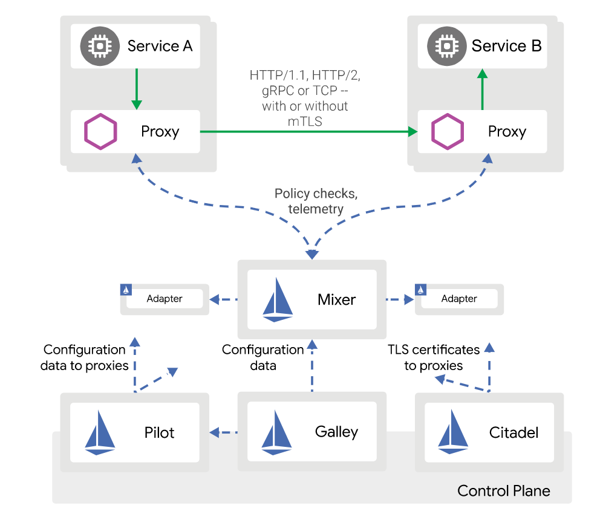

## Istio

官网： https://istio.io/

GitHub： https://github.com/istio/istio

中文文档： https://preliminary.istio.io/zh/docs/concepts/what-is-istio/

> Istio是一个十分流行的service mesh项目，它起源于Lyft。 
>
>
> 参考： 官网，GitHub，中文文档，Bilibili-向上的信念-Istio教程， 
> https://developers.redhat.com/blog/2018/03/20/istio-circuit-breaker-pool-ejection/，
> https://docs.flagger.app/usage/ab-testing，
> https://www.oreilly.com/library/view/chaos-engineering/9781491988459/

### 目录
* [功能特性](#Istio的功能特性)
* [应用扩展](#Istio的应用)
* [架构](#Istio的架构)
* [Istio与Spring Cloud相应组件对比](#Istio与Spring-Cloud组件对比)

### Istio的功能特性

Connect, secure, control, and observe services.

* 连接 Connect： （流量管理） 负载均衡，动态路由，灰度发布，故障注入
* 安全加固 Secure： （服务身份和安全） 认证，鉴权
* 控制 Control： （策略执行） 限流，ACL访问规则的配置
* 观察 Observe： 调用链，访问日志，监控

Istio是一个十分流行的service mesh项目，它起源于Lyft。

Service Mesh的好处是将服务治理作为通用组件，下沉到平台层实现，不再与应用层绑定，使得应用层仅仅需要关注业务逻辑。

云原生的微服务治理解决方案： kubernetes+Istio

* HTTP、gRPC 和 TCP 网络流量的自动负载均衡；
* 提供了丰富的路由规则、重试、故障转移和故障注入，实现细粒度的网络流量行为控制；
* 流量加密、服务间认证，以及强身份声明；
* 全范围（Fleet-wide）的策略执行；
* 深度遥测和报告。

### Istio的应用

* Istio + Kubernetes ： 云原生应用治理+云原生应用设施

    Istio可以完美的补齐Kubernetes缺乏服务治理的缺陷。
    
    Kubernetes提供了很强的部署运维能力（部署、运维、扩缩容、服务发现、负载均衡），但是在服务发现和负载均衡比较简单。
    
    Istio的服务治理（调用链追踪、动态路由、熔断限流...）跟Kubernetes完美结合。
    
* 支持的扩展平台： 
    * Kubernetes (K8s)  应用容器化管理
    * Cloud Foundry
    * Eureka
    * Consul

* 还可以集成和定制一些功能：
    * ACL 安全规则
    * 日志
    * 配额
    
### Istio的架构

Istio从逻辑上分为数据平面和控制平面

* 数据平面中的Sidecar代理是由Envoy组件（C++开发的高性能代理）承担。

    Envoy提供了很多内在的特性如：
    * 动态服务发现
    * 负载均衡
    * TLS终止
    * HTTP/2和gRPC代理
    * 熔断器
    * 健康检查
    * 基于百分比的流量分割
    * 故障注入
    * 丰富的指标
    
* 控制平面Pilot、Galley、Citadel、Mixer。

1. Service A , Service B  用户的服务。
2. Proxy 在Istio中默认是envoy， 主要做服务之间的转发
3. Service A + Proxy， Service B + Proxy 构成了Istio的数据面，用户的服务之间的互访的数据面。
4. Istio的控制面： Pilot、Galley、Citadel、Mixer
5. Pilot： 配置规则到Istio-Proxy(envoy)里面，如跟Kubernetes对接，会配置一些获取Kubernetes的源信息，或者是用户定义的规则，路由规则等实现服务之间的服务治理。
6. Mixer： 主要包括两部分，Policy checks(策略管理，服务通信时能不能访问、多频繁的访问)，telemetry(监控，调用链分析)
7. Citadel： 用来配置服务之间访问的安全，证书生成和下发，在Citadel里统一管理。
8. Galley： 验证用户配置的规则有没有效果。

### Istio与Spring Cloud组件对比

Spring Cloud 服务治理：
* 优点：提供较全的微服务治理全套解决方案，对开发人员友好。
* 缺点：只能java平台技术栈使用，当然提供了SideCar用于集成异构技术但是限制比较大；对代码侵入强

Istio 服务治理：
* 优点： 关注点分离，对代码无侵入；服务治理相关较全面。
* 缺点： 目前只与K8s结合较好。

<table>
  <tr><th>对比项</th><th>Spring Cloud</th><th>Istio</th></tr>
  <tr><td>自动扩展，自我修复</td><td>Spring Cloud Config - 健康指示器 Health Indicator 配置服务器附带一个健康指示器，用于检查配置的环境存储库是否工作。 Spring Cloud Eureka动态扩容</td><td>Istio Circuit Breaker: Handle (Pool) Ejection 容器自动扩缩容，Istio为主要组件gateway，pilot与mixer设置了自动扩缩容策略，且策略可以在安装时配置</td></tr>
  <tr><td>API网关</td><td>zuul</td><td>Mixer</td></tr>
  <tr><td>负载均衡</td><td>ribbon</td><td>envoy</td></tr>
  <tr><td>配置管理</td><td>spring Cloud Config分布式配置管理</td><td>无</td></tr>
  <tr><td>应用程序打包</td><td>Spring boot maven/gradle</td><td>无</td></tr>
  <tr><td>批处理</td><td>Spring Cloud Task，Spring Batch轻量级批处理框架</td><td>无</td></tr>
  <tr><td>进程隔离</td><td>无</td><td>envoy</td></tr>
  <tr><td>服务链路追踪</td><td>Spring Cloud Sleuth</td><td>Mixer</td></tr>
  <tr><td>容错，断路器</td><td>Hystrix</td><td>envoy</td></tr>
  <tr><td>通信方式</td><td>HTTP、message</td><td>双向TLS(将明文传输的服务通信，转换为 Envoy 之间的加密通信。)</td></tr>
  <tr><td>安全模块</td><td>Spring Cloud Security</td><td>Citadel 在具有强大的基于身份验证和授权的集群中实现安全的服务到服务间通信</td></tr>
  <tr><td>消息总线</td><td>Spring Cloud Bus，支持RabbitMQ的自动化配置和Kafka</td><td>无</td></tr>
  <tr><td>部署和编排</td><td>无</td><td>无。Istio集成Kubernetes，部署策略</td></tr>
  <tr><td>集成</td><td>来源于Spring，天然支持Spring Boot，更加便于业务落地</td><td>独立于平台，与语言无绑定。目前支持的扩展：Kubernetes (K8s)，Cloud Foundry，Eureka，Consul</td></tr>
  <tr><td>首次发版</td><td>2015年3月发布Angel版本</td><td>2017年5月发布0.1版</td></tr>
  <tr><td>开源协议</td><td>Apache License 2.0</td><td>Apache License 2.0</td></tr>
</table>

