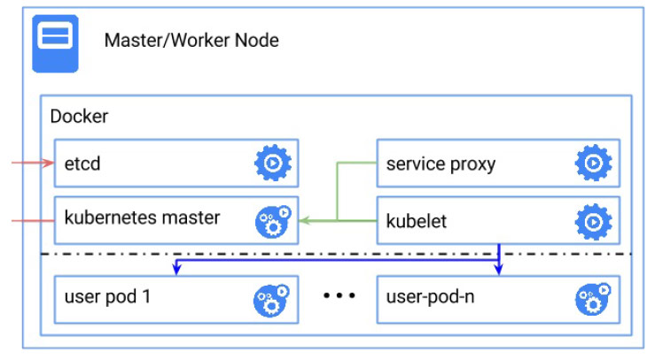

## 基于Docker本地方案

> 本页测试是在本机虚拟机操作的。
>
> 本机虚拟机 VM-1 192.168.229.128 （root-jiaxiaojiao）
> 环境： CentOS 7 64位
>

### 目录
* [本地方案](#本地方案)
* [基于Docker本地运行Kubernetes](#基于Docker本地运行Kubernetes)
    * [条件](#条件)
    * [创建Kubernetes集群步骤](#创建Kubernetes集群步骤)

### 本地方案
本地服务器方案在一台物理机上创建拥有一个或者多个Kubernetes节点的单机集群。创建过程是全自动的，且不需要任何云服务商的账户。但是这种单机集群的规模和可用性都受限于单台机器。

本地服务器方案有哪些？
* 基于Docker本地运行Kubernetes
* Vagrant (任何支持Vagrant的平台：Linux，MacOS，或者Windows。)
* 无虚拟机本地集群 (Linux)

### 基于Docker本地运行Kubernetes
通过Docker创建一个单机、单节点的Kubernetes集群



#### 条件
1. [一台安装有Docker的机器](#验证是否成功安装Docker)
2. [内核支持 memory and swap accounting](#验证内核是否支持-memory-and-swap-accounting)
3. [在内核启动时开启 memory and swap accounting](#验证在内核启动时是否开启-memory-and-swap-accounting)

##### 验证是否成功安装Docker
```text
## 验证是否安装Docker
## 如下已经成功安装Docker。
[root@bogon ~]# docker

Usage:	docker COMMAND

A self-sufficient runtime for containers

Options:
      --config string      Location of client config files (default "/root/.docker")
  -D, --debug              Enable debug mode
      --help               Print usage
  -H, --host list          Daemon socket(s) to connect to (default [])
  -l, --log-level string   Set the logging level ("debug", "info", "warn", "error", "fatal") (default "info")
      --tls                Use TLS; implied by --tlsverify
      --tlscacert string   Trust certs signed only by this CA (default "/root/.docker/ca.pem")
      --tlscert string     Path to TLS certificate file (default "/root/.docker/cert.pem")
      --tlskey string      Path to TLS key file (default "/root/.docker/key.pem")
      --tlsverify          Use TLS and verify the remote
  -v, --version            Print version information and quit

Management Commands:
  container   Manage containers
  image       Manage images
  network     Manage networks
  node        Manage Swarm nodes
  plugin      Manage plugins
  secret      Manage Docker secrets
  service     Manage services
  stack       Manage Docker stacks
  swarm       Manage Swarm
  system      Manage Docker
  volume      Manage volumes

Commands:
  attach      Attach to a running container
  build       Build an image from a Dockerfile
  commit      Create a new image from a container's changes
  cp          Copy files/folders between a container and the local filesystem
  create      Create a new container
  diff        Inspect changes on a container's filesystem
  events      Get real time events from the server
  exec        Run a command in a running container
  export      Export a container's filesystem as a tar archive
  history     Show the history of an image
  images      List images
  import      Import the contents from a tarball to create a filesystem image
  info        Display system-wide information
  inspect     Return low-level information on Docker objects
  kill        Kill one or more running containers
  load        Load an image from a tar archive or STDIN
  login       Log in to a Docker registry
  logout      Log out from a Docker registry
  logs        Fetch the logs of a container
  pause       Pause all processes within one or more containers
  port        List port mappings or a specific mapping for the container
  ps          List containers
  pull        Pull an image or a repository from a registry
  push        Push an image or a repository to a registry
  rename      Rename a container
  restart     Restart one or more containers
  rm          Remove one or more containers
  rmi         Remove one or more images
  run         Run a command in a new container
  save        Save one or more images to a tar archive (streamed to STDOUT by default)
  search      Search the Docker Hub for images
  start       Start one or more stopped containers
  stats       Display a live stream of container(s) resource usage statistics
  stop        Stop one or more running containers
  tag         Create a tag TARGET_IMAGE that refers to SOURCE_IMAGE
  top         Display the running processes of a container
  unpause     Unpause all processes within one or more containers
  update      Update configuration of one or more containers
  version     Show the Docker version information
  wait        Block until one or more containers stop, then print their exit codes

Run 'docker COMMAND --help' for more information on a command.

```

##### 验证内核是否支持 memory and swap accounting

memory and swap accounting 是 统计Linux内核的内存和交换区。

确认你的linux内核开启了如下配置：

    CONFIG_RESOURCE_COUNTERS=y
    CONFIG_MEMCG=y
    CONFIG_MEMCG_SWAP=y
    CONFIG_MEMCG_SWAP_ENABLED=y
    CONFIG_MEMCG_KMEM=y

```text
## 验证Linux内核是否支持 memory and swap accounting
### 1. 查看Linux内核，使用命令 zcat /proc/config.gz
[root@bogon ~]# zcat /proc/config.gz
gzip: /proc/config.gz: No such file or directory
### 不存在，不知道怎么查看，跳过吧，，，
```

##### 验证在内核启动时是否开启 memory and swap accounting
```text
### 1. sudo权限登录系统
[root@bogon ~]# sudo -i
[root@bogon ~]#

### 2. 查看是否开启
### 如果开启了，会有“cgroup_enable=memory”和 “swapaccount=1”的字眼，如果没有，需要修改grub启动参数。
[root@bogon ~]# cat /proc/cmdline
BOOT_IMAGE=/vmlinuz-3.10.0-1062.el7.x86_64 root=/dev/mapper/centos-root ro crashkernel=auto spectre_v2=retpoline rd.lvm.lv=centos/root rd.lvm.lv=centos/swap rhgb quiet LANG=zh_CN.UTF-8
[root@bogon ~]# 

### 3. 修改grub启动参数
#### 3.1 编辑 /etc/default/grub 文件
[root@bogon ~]# vim /etc/default/grub

#### 3.2 在GRUB_CMDLINE_LINUX 引号内末尾添加 cgroup_enable=memory swapaccount=1 ， 如下
GRUB_TIMEOUT=5
GRUB_DISTRIBUTOR="$(sed 's, release .*$,,g' /etc/system-release)"
GRUB_DEFAULT=saved
GRUB_DISABLE_SUBMENU=true
GRUB_TERMINAL_OUTPUT="console"
GRUB_CMDLINE_LINUX="crashkernel=auto spectre_v2=retpoline rd.lvm.lv=centos/root rd.lvm.lv=centos/swap rhgb quiet cgroup_enable=memory swapaccount=1"
GRUB_DISABLE_RECOVERY="true"
~                                                                                                                                     
~                                                                                                                                     
~                                                                                                                                     
~                                                                                                                                     
~                                                                                                                                     
~                                                                                                                                     
~                                                                                                                                     
~                                                                                                                                     
~                                                                                                                                     
~                                                                                                                                     
~                                                                                                                                     
~                                                                                                                                     
~                                                                                                                                     
~                                                                                                                                     
-- 插入 -- 

#### 3.3 保存后, 更新grub.cfg， 命令 update-grub
#### 如果是grub2，用命令 grub2-mkconfig -o /boot/grub2/grub.cfg 创建新的启动菜单
#### 重启系统
[root@bogon ~]# update-grub
-bash: update-grub: 未找到命令
[root@bogon ~]# grub2-mkconfig -o /boot/grub2/grub.cfg
Generating grub configuration file ...
Found linux image: /boot/vmlinuz-3.10.0-1062.el7.x86_64
Found initrd image: /boot/initramfs-3.10.0-1062.el7.x86_64.img
Found linux image: /boot/vmlinuz-0-rescue-9ca7be906e2840989047f224cc68c5d0
Found initrd image: /boot/initramfs-0-rescue-9ca7be906e2840989047f224cc68c5d0.img
done
#### 3.4 再次查看
[root@bogon ~]# cat /proc/cmdline
BOOT_IMAGE=/vmlinuz-3.10.0-1062.el7.x86_64 root=/dev/mapper/centos-root ro crashkernel=auto spectre_v2=retpoline rd.lvm.lv=centos/root rd.lvm.lv=centos/swap rhgb quiet cgroup_enable=memory swapaccount=1


```

#### 创建Kubernetes集群步骤
1. 运行Etcd
2. 启动master
3. 运行service proxy

```text
## 1. 运行Etcd
### 如果没有，安装Etcd，使用命令 yum install etcd
[root@bogon ~]# yum install etcd
已加载插件：fastestmirror
Loading mirror speeds from cached hostfile
 * base: mirrors.huaweicloud.com
 * extras: mirrors.tuna.tsinghua.edu.cn
 * updates: mirrors.tuna.tsinghua.edu.cn
base                                                                                                           | 3.6 kB  00:00:00     
extras                                                                                                         | 2.9 kB  00:00:00     
mysql-connectors-community                                                                                     | 2.5 kB  00:00:00     
mysql-tools-community                                                                                          | 2.5 kB  00:00:00     
mysql57-community                                                                                              | 2.5 kB  00:00:00     
updates                                                                                                        | 2.9 kB  00:00:00     
updates/7/x86_64/primary_db                                                                                    | 5.8 MB  00:00:07     
正在解决依赖关系
--> 正在检查事务
---> 软件包 etcd.x86_64.0.3.3.11-2.el7.centos 将被 安装
--> 解决依赖关系完成

依赖关系解决

======================================================================================================================================
 Package                    架构                         版本                                      源                            大小
======================================================================================================================================
正在安装:
 etcd                       x86_64                       3.3.11-2.el7.centos                       extras                        10 M

事务概要
======================================================================================================================================
安装  1 软件包

总下载量：10 M
安装大小：45 M
Is this ok [y/d/N]: y
Downloading packages:
etcd-3.3.11-2.el7.centos.x86_64.rpm                                                                            |  10 MB  00:00:10     
Running transaction check
Running transaction test
Transaction test succeeded
Running transaction
  正在安装    : etcd-3.3.11-2.el7.centos.x86_64                                                                                   1/1 
  验证中      : etcd-3.3.11-2.el7.centos.x86_64                                                                                   1/1 

已安装:
  etcd.x86_64 0:3.3.11-2.el7.centos                                                                                                   

完毕！
[root@bogon ~]# 


```


#### 测试Kubernetes集群


