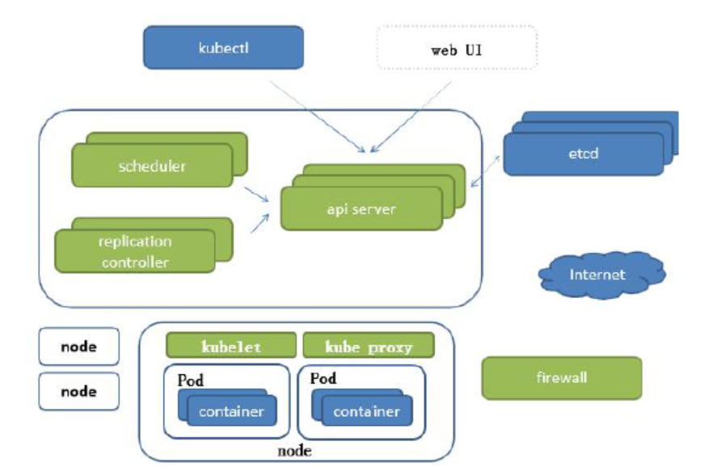
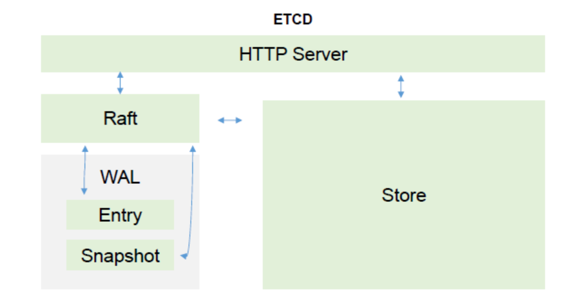

## Kubernetes 组件

> Kubernetes是Google Borg 调度系统的Go语言重构版。
>
> Kubernetes最初源于谷歌内部的Borg，提供了面向应用的容器集群部署和管理系统。Kubernetes 的目标旨在消除编排物理/虚拟计算，网络和存储基础设施的负担，并使应用程序运营商和开发人员完全将重点放在以容器为中心的原语上进行自助运营。
>

### 目录
* [Borg组件说明](#Borg组件说明)
* [K8S结构说明/架构](#K8S结构说明/架构)
    * Master 组件
    * Node 节点组件
    * [Kubectl 命令行管理工具](#Kubectl-命令行管理工具)

### Borg组件说明


Borg主要由BorgMaster、Borglet、borgcfg和Scheduler组成
* 支持的访问方式调度集群的管理 ： web browsers 浏览器， command-line tools 命令行， config file - borgcfg 配置文件读取。 
* BorgMaster ： 负责请求的分发，是整个集群的大脑，负责维护整个集群的状态，并将数据持久化到Paxos存储中。为了防止BorgMaster单节点故障，高可用集群节点个数 >= 3 奇数。
* Borglet ： 负责真正运行任务（在容器中）。
* Scheduer 调度器，根据应用的特点将其调度到具体的机器上去。
* borgcfg 是Borg的命令行工具，用于跟Borg系统交互，一般通过一个配置文件来提交任务。

流程：
1. 访问/接入 BorgMaster，处理请求，分发（link shard）到不同的Borglet节点运行。
2. 调度器scheduler把数据写入数据库Paxos存储。
3. Borglet 监听数据库Paxos，消费请求，处理请求。

### K8S结构说明/架构


架构： 
* Master。 包括： 。
* Node 节点。kubelet ， kube proxy， container 容器引擎（docker）。 执行

组件：
* Master 组件。提供集群的管理控制中心，包括： Scheduler 调度器(kube-scheduler)，Api Server (kube-apiserver) ， Replication Controller 控制器(kube-controller-manager)， cloud-controller-manager 云控制器管理器，ETCD
    * Scheduler 调度器（kube-scheduler）。监视新创建没有分配到Node的Pod，为Pod选择一个Node。负责介绍任务，选择合适的节点进行分配任务。会调用Api Server， Api Server 负责把数据写入 etcd。
    * Api Server (kube-apiserver)。用于暴露Kubernetes API。任何的资源请求/调用操作都是通过kube-apiserver提供的接口进行。是一切服务访问的入口。提供了认证、授权、访问控制、API注册和发现等机制。
    * Replication Controller 控制器（kube-controller-manager）。 负责维护集群的状态，比如故障检测、自动扩展、滚动更新等。维持副本期望数目。创建/删除对应的pod。
    * cloud-controller-manager 云控制器管理器负责与底层云提供商的平台交互。云控制器管理器是Kubernetes版本1.6中引入的，目前还是Alpha的功能。
    * etcd。 Kubernetes提供默认的存储系统，保存所有集群数据，使用时需要为etcd数据提供备份计划。键值对数据库。储存K8S集群所有重要信息（持久化）
* Node 节点组件。 提供Kubernetes运行时环境，以及维护Pod。
    * kubelet  直接跟容器引擎交互实现容器的生命周期管理。跟CRI(container runtime interface) Docker交互，操作Docker创建对应的容器。维持Pod的生命周期。
    * kube proxy 通过在主机上维护网络规则并执行连接转发来实现Kubernetes服务抽象。负载均衡，负责写入规则至 IPTABLES、IPVS 实现服务映射访问的。
    * docker 运行容器 / RKT 运行容器 
* Kubectl 命令行管理工具。


其他插件： 
* CoreDNS：可以为集群中的SVC创建一个域名IP的对应关系解析
* Dashboard：给 K8S 集群提供一个 B/S 结构访问体系
* Ingress Controller：Kubernetes官方只能实现四层代理，INGRESS 可以实现七层代理
* Federation：提供一个可以跨集群中心多K8S统一管理功能
* Prometheus：提供K8S集群的监控能力
* ELK：提供 K8S 集群日志统一分析介入平台

流程：
1. Scheduler 调度器会调用Api Server， Api Server 负责把数据写入 etcd。

#### ETCD架构



etcd的官方将它定位成一个可信赖的分布式键值存储服务，它能够为整个分布式集群存储一些关键数据，协助分布式集群的正常运转。

* 可信赖： 不会出现单节点故障，天然集群化。
* 分布式： 扩容方便。
* 键值： 存储的格式。

Etcd Storage 存储有两个版本：
* V2  存储在Memory 内存中。
* V3  存储在Database 数据库中。本地的持久化数据库。不会造成数据丢失。

推荐在Kubernetes 集群中使用Etcd V3版。 V2 版本在Kubernetes v1.11中弃用。

### Kubectl 命令行管理工具
Kubectl用于运行Kubernetes集群命令的管理工具。

#### 语法
在管理工具界面使用kubectl语法运行如下命令：

```text
kubectl [command] [TYPE] [NAME] [flags]
```

* command：指定要在一个或多个资源执行的操作，例如操作create，get，describe，delete。
* TYPE：指定资源类型Resource types。

#### [安装和设置kubectl](Kubernetes-kubectl-install.md)

#### [Kubectl命令](Kubernetes-kubectl-CLI.md)
