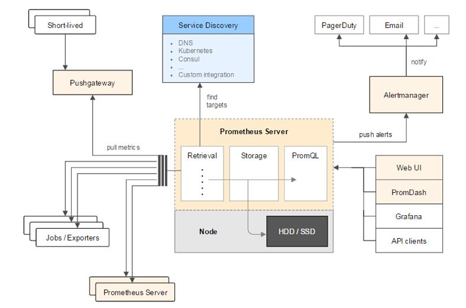

## Prometheus
**_重点学习_**

网站： https://prometheus.io/

文档： https://prometheus.io/docs/introduction/overview/

源码： https://github.com/prometheus/prometheus

> 普罗米修斯
>
> (入门门槛有点高)

### 目录
* [Prometheus 是什么？](#Prometheus-是什么？)
* [Prometheus 的背景](#Prometheus-的背景)
* [Prometheus 有哪些特点？](#Prometheus-有哪些特点？)
* [Prometheus 的整体架构](#Prometheus-的整体架构)
* [Prometheus 的工作流程](#Prometheus-的工作流程)
* [有哪些使用场景/案例？](#有哪些使用场景/案例？)
* [参考](#参考)

### Prometheus 是什么？
> Prometheus, a Cloud Native Computing Foundation project, is a systems and service monitoring system. It collects metrics from configured targets at given intervals, evaluates rule expressions, displays the results, and can trigger alerts if some condition is observed to be true.

Prometheus是一个云计算基础项目，是一个系统和服务监控系统。它以给定的时间间隔从配置的目标收集指标，计算规则表达式，显示结果，并且可以在观察到某些条件为真时触发警报。

Prometheus 是监测系统和时间序列数据库。

Prometheus 是由SoundCloud开发的开源监控报警系统和时序列数据库。从字面上理解，Prometheus由两个部分组成，一个是监控报警系统，另一个是自带的时序数据库（TSDB）。

### Prometheus 的背景
Kubernetes从2014年开源以来，迅速成为容器管理的领头羊，它是Google Borg系统的开源实现。和Kubernetes一起火起来的还有另一个开源项目Prometheus，它是Google BorgMon的开源实现。

2016年，由Google发起的Linux基金会旗下的原生云基金会（Cloud Native Computing Foundation）将Prometheus纳入其第二大开源项目。Prometheus在开源社区也十分活跃。

### Prometheus 有哪些特点？
> a multi-dimensional data model (timeseries defined by metric name and set of key/value dimensions)
>
> a flexible query language to leverage this dimensionality
>
> no dependency on distributed storage; single server nodes are autonomous
>
> timeseries collection happens via a pull model over HTTP
>
> pushing timeseries is supported via an intermediary gateway
>
> targets are discovered via service discovery or static configuration
>
> multiple modes of graphing and dashboarding support
>
> support for hierarchical and horizontal federation

与其他监控系统相比，Prometheus有哪些的特点：
* 多维数据模型(由度量名称和键/值维集定义的timeseries)
* 一种灵活的查询语言来利用这种维度
* 不依赖分布式存储;单个服务器节点是自治的
* timeseries时序数据的收集通过HTTP的pull方式进行。 
* 通过中间网关进行timeseries时序数据的推送
* 通过服务发现或静态配置发现目标
* 支持多种模式的图表和界面展示
* 支持层次和水平联合

采集数据方式pull： Prometheus采集数据是用的pull也就是拉模型,通过HTTP协议去采集指标，只要应用系统能够提供HTTP接口就可以接入监控系统，相比于私有协议或二进制协议来说开发、简单。

### Prometheus 的整体架构

主要组件：
* Prometheus Server: 用于收集和存储时间序列数据。Prometheus Server是Prometheus组件中的核心部分，负责实现对监控数据的获取，存储以及查询。 Prometheus Server可以通过静态配置管理监控目标，也可以配合使用Service Discovery的方式动态管理监控目标，并从这些监控目标中获取数据。其次Prometheus Server需要对采集到的监控数据进行存储，Prometheus Server本身就是一个时序数据库，将采集到的监控数据按照时间序列的方式存储在本地磁盘当中。最后Prometheus Server对外提供了自定义的PromQL语言，实现对数据的查询以及分析。
* Client Library: 客户端库，为需要监控的服务生成相应的 metrics 并暴露给 Prometheus server。当 Prometheus server 来 pull 时，直接返回实时状态的 metrics。
* Push Gateway: 主要用于短期的 jobs。由于这类 jobs 存在时间较短，可能在 Prometheus 来 pull 之前就消失了。为此，这些 jobs 可以直接向 Prometheus server 端推送它们的 metrics。
* Exporters: 用于暴露已有的第三方服务的 metrics 给 Prometheus。Exporter将监控数据采集的端点通过HTTP服务的形式暴露给Prometheus Server，Prometheus Server通过访问该Exporter提供的Endpoint端点，即可获取到需要采集的监控数据。
* Alertmanager: 从 Prometheus server 端接收到 alerts 后，会进行去除重复数据，分组，并路由到对方的接受方式，发出报警。常见的接收方式有：电子邮件，pagerduty 等。
* WEB UI：Prometheus Server内置的Express Browser UI，通过这个UI可以直接通过PromQL实现数据的查询以及可视化。
* 一些其他的工具。

### Prometheus 的工作流程
Prometheus大概的工作流程是：
1. Prometheus server 定期从配置好的 jobs 或者 exporters 中拉 metrics，或者接收来自 Pushgateway 发过来的 metrics，或者从其他的 Prometheus server 中拉 metrics。
2. Prometheus server 在本地存储收集到的 metrics，并运行已定义好的 alert.rules，记录新的时间序列或者向 Alertmanager 推送警报。
3. Alertmanager 根据配置文件，对接收到的警报进行处理，发出告警。
4. 在图形界面中，可视化采集数据。

### 有哪些使用场景/案例？
* Kubernetes添加Prometheus插件提供K8S集群的监控能力
* Prometheus + grafana 系统和容器信息一起监控

### 参考
* `官网`
* `http://www.sohu.com/a/342733264_198222`
* `https://blog.csdn.net/peterwanghao/article/details/89148097`