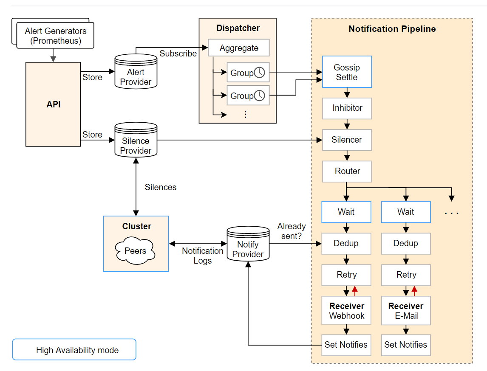

## Alertmanager
**_学习_**

文档： https://prometheus.io/docs/alerting/alertmanager/

源码： https://github.com/prometheus/alertmanager

报警神器

### 目录
* [Alertmanager 是什么？](#Alertmanager-是什么？)
* [Alertmanager 的功能有哪些？](#Alertmanager-的功能有哪些？)
* [Alertmanager 的内部架构](#Alertmanager-的内部架构)
* [参考](#参考)

### Alertmanager 是什么？
Alertmanager 处理客户端应用程序(如Prometheus服务器)发送的警报。它负责删除、分组和将它们路由到正确的接收方集成，如电子邮件、PagerDuty或OpsGenie。它还负责保持警报的沉默和抑制。

Alertmanager 主要用于接收 Prometheus 发送的告警信息，它支持丰富的告警通知渠道，而且很容易做到告警信息进行去重，降噪，分组等，是一款前卫的告警通知系统。

Alertmanager和Prometheus密不可分，是Prometheus的模块之一，需要独立安装。

Alertmanager 主要用于接收 Prometheus 发送的告警信息，它很容易做到告警信息的去重，降噪，分组，策略路由，是一款前卫的告警通知系统。它支持丰富的告警通知渠道，可以将告警信息转发到邮箱、企业微信、钉钉等。这一节讲解利用AlertManager，把接受到的告警信息，转发到邮箱。

### Alertmanager 的功能有哪些？
Alertmanager 的目标不是简单地"发出警报"，而是"发出高质量的警报"。它提供的高级功能包括但不限于：
* Go Template 渲染警报内容；
* 管理警报的重复提醒时机与消除后消除通知的发送；
* 根据标签定义警报路由，实现警报的优先级、接收人划分，并针对不同的优先级和接收人定制不同的发送策略；
* 将同类型警报打包成一条通知发送出去，降低警报通知的频率；
* 支持静默规则: 用户可以定义一条静默规则，在一段时间内停止发送部分特定的警报，比如已经确认是搜索集群问题，在修复搜索集群时，先静默掉搜索集群相关警报；
* 支持"抑制"规则(Inhibition Rule): 用户可以定义一条"抑制"规则，规定在某种警报发生时，不发送另一种警报，比如在"A 机房网络故障"这条警报发生时，不发送所有"A 机房中的警报"；

### Alertmanager 的内部架构

从左上开始：
1. Prometheus 发送的警报到 Alertmanager;
2. 警报会被存储到 AlertProvider 中，Alertmanager 的内置实现就是包了一个 map，也就是存放在本机内存中，这里可以很容易地扩展其它 Provider;
3. Dispatcher 是一个单独的 goroutine，它会不断到 AlertProvider 拉新的警报，并且根据 YAML 配置的 Routing Tree 将警报路由到一个分组中;
4. 分组会定时进行 flush (间隔为配置参数中的 group_interval), flush 后这组警报会走一个 Notification Pipeline 链式处理;
5. Notification Pipeline 为这组警报确定发送目标，并执行抑制逻辑，静默逻辑，去重逻辑，发送与重试逻辑，实现警报的最终投递;

Alertmanager 整体的设计意图就是奔着治理警报（通知）去的，首先它用 Routing Tree 来帮助用户定义警报的归类与发送逻辑，然后再用 Notification Pipeline 来做抑制、静默、去重以提升警报质量。这些功能虽然不能解决"警报"这件事中所有令人头疼的问题，但确实为我们着手去解决"警报质量"相关问题提供了趁手的工具。

### 参考
* `官网`
* `https://zhuanlan.zhihu.com/p/63270049`

