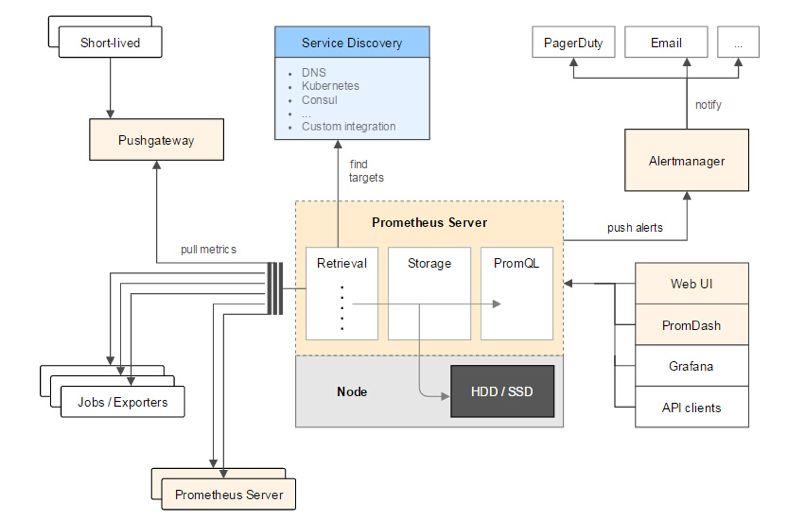

## Prometheus
**_重点学习_**

网站： https://prometheus.io/

文档： https://prometheus.io/docs/introduction/overview/

文档： https://prometheus.io/docs/prometheus/latest/getting_started/

源码： https://github.com/prometheus/prometheus

> 普罗米修斯
>
> 网上说入门门槛有点高，不知道...
>
> 不会不懂的时候多看看日志，看看文档。

### 目录
* [Prometheus 是什么？](#Prometheus-是什么？)
* [Prometheus 的背景](#Prometheus-的背景)
* [Prometheus 有哪些特点？](#Prometheus-有哪些特点？)
* [Prometheus 的整体架构](#Prometheus-的整体架构)
* [Prometheus 的工作流程](#Prometheus-的工作流程)
* [Prometheus 常用的概念](#Prometheus-常用的概念)
* [有哪些使用场景/案例？](#有哪些使用场景/案例？)
* 安装
    * [安装Prometheus Server](Prometheus-install.md)
    * [搭建监控系统Prometheus+Alertmanager+Grafana](Prometheus-install2.md)
* 使用/监控什么？
    * [Prometheus监控服务器](#Prometheus监控服务器)
* 问题排查
    * [Prometheus数据不显示](Prometheus-error.md)
* [参考](#参考)

### Prometheus 是什么？
> Prometheus, a Cloud Native Computing Foundation project, is a systems and service monitoring system. It collects metrics from configured targets at given intervals, evaluates rule expressions, displays the results, and can trigger alerts if some condition is observed to be true.

为解决监控容器的问题，引入了prometheus技术。prometheus号称是下一代监控。

Prometheus是一个云计算基础项目，是一个系统和服务监控系统。它以给定的时间间隔从配置的目标收集指标，计算规则表达式，显示结果，并且可以在观察到某些条件为真时触发警报。

Prometheus 是监测系统和时间序列数据库。

Prometheus 是由SoundCloud开发的开源监控报警系统和时序列数据库。从字面上理解，Prometheus由两个部分组成，一个是监控报警系统，另一个是自带的时序数据库（TSDB）。

### Prometheus 的背景
Kubernetes从2014年开源以来，迅速成为容器管理的领头羊，它是Google Borg系统的开源实现。和Kubernetes一起火起来的还有另一个开源项目Prometheus，它是Google BorgMon的开源实现。

2016年，由Google发起的Linux基金会旗下的原生云基金会（Cloud Native Computing Foundation）将Prometheus纳入其第二大开源项目。Prometheus在开源社区也十分活跃。

### Prometheus 有哪些特点？
> a multi-dimensional data model (timeseries defined by metric name and set of key/value dimensions)
>
> a flexible query language to leverage this dimensionality
>
> no dependency on distributed storage; single server nodes are autonomous
>
> timeseries collection happens via a pull model over HTTP
>
> pushing timeseries is supported via an intermediary gateway
>
> targets are discovered via service discovery or static configuration
>
> multiple modes of graphing and dashboarding support
>
> support for hierarchical and horizontal federation

与其他监控系统相比，Prometheus有哪些的特点：
* 多维数据模型(由度量名称和键/值维集定义的timeseries)。
* 一种灵活的查询语言来利用这种维度。 在同一个查询语句，可以对多个 metrics 进行乘法、加法、连接、取分数位等操作。
* 不依赖分布式存储；单个服务器节点是自治的。
* timeseries时序数据的收集通过HTTP的pull方式进行。 
* 通过中间网关进行timeseries时序数据的推送。
* 通过服务发现或静态配置发现目标。
* 支持多种模式的图表和界面展示。
* 支持层次和水平联合。

采集数据方式pull： Prometheus采集数据是用的pull也就是拉模型,通过HTTP协议去采集指标，只要应用系统能够提供HTTP接口就可以接入监控系统，相比于私有协议或二进制协议来说开发、简单。

### Prometheus 的整体架构


主要组件：
* Prometheus Server: 用于收集和存储时间序列数据。Prometheus Server是Prometheus组件中的核心部分，负责实现对监控数据的获取，存储以及查询。 Prometheus Server可以通过静态配置管理监控目标，也可以配合使用Service Discovery的方式动态管理监控目标，并从这些监控目标中获取数据。其次Prometheus Server需要对采集到的监控数据进行存储，Prometheus Server本身就是一个时序数据库，将采集到的监控数据按照时间序列的方式存储在本地磁盘当中。最后Prometheus Server对外提供了自定义的PromQL语言，实现对数据的查询以及分析。
* Client Library: 客户端库，为需要监控的服务生成相应的 metrics 并暴露给 Prometheus server。当 Prometheus server 来 pull 时，直接返回实时状态的 metrics。
* Push Gateway: 主要用于短期的 jobs。由于这类 jobs 存在时间较短，可能在 Prometheus 来 pull 之前就消失了。为此，这些 jobs 可以直接向 Prometheus server 端推送它们的 metrics。
* Exporters: 用于暴露已有的第三方服务的 metrics 给 Prometheus。Exporter将监控数据采集的端点通过HTTP服务的形式暴露给Prometheus Server，Prometheus Server通过访问该Exporter提供的Endpoint端点，即可获取到需要采集的监控数据。
* Alertmanager: 从 Prometheus server 端接收到 alerts 后，会进行去除重复数据，分组，并路由到对方的接受方式，发出报警。常见的接收方式有：电子邮件，pagerduty 等。
* WEB UI：Prometheus Server内置的Express Browser UI，通过这个UI可以直接通过PromQL实现数据的查询以及可视化。
* 一些其他的工具。

### Prometheus 的工作流程
Prometheus大概的工作流程是：
1. Prometheus server 定期从配置好的 jobs 或者 exporters 中拉 metrics，或者接收来自 Pushgateway 发过来的 metrics，或者从其他的 Prometheus server 中拉 metrics。
2. Prometheus server 在本地存储收集到的 metrics，并运行已定义好的 alert.rules，记录新的时间序列或者向 Alertmanager 推送警报。
3. Alertmanager 根据配置文件，对接收到的警报进行处理，发出告警。
4. 在图形界面中，可视化采集数据。

### Prometheus 常用的概念
##### 数据模型
Prometheus 从根本上存储的所有数据都是时间序列数据（Time Serie Data，简称时序数据）。时序数据是具有时间戳的数据流，该数据流属于某个度量指标（Metric）和该度量指标下的多个标签（Label）。除了提供存储功能，Prometheus 还可以利用查询表达式来执行非常灵活和复杂的查询。

##### 度量指标和标签
prometheus采集到的监控数据均以metric（指标）形式保存在时序数据库中（TSDB）。

每个时间序列（Time Serie，简称时序）由度量指标和一组标签键值对唯一确定。

每一条时间序列由 metric 和 labels 组成，每条时间序列按照时间的先后顺序存储它的样本值。

度量指标名称描述了被监控系统的某个测量特征（比如 http_requests_total 表示 http 请求总数）。度量指标名称由 ASCII 字母、数字、下划线和冒号组成，须匹配正则表达式 `[a-zA-Z_:][a-zA-Z0-9_:]*` 。

标签开启了 Prometheus 的多维数据模型。对于同一个度量指标，不同标签值组合会形成特定维度的时序。Prometheus 的查询语言可以通过度量指标和标签对时序数据进行过滤和聚合。改变任何度量指标上的任何标签值，都会形成新的时序。标签名称可以包含 ASCII 字母、数字和下划线，须匹配正则表达式 `[a-zA-Z_][a-zA-Z0-9_]*` ，带有 `_`下划线的标签名称保留为内部使用。标签值可以包含任意 Unicode 字符，包括中文。

##### 采样值（Sample）
时序数据其实就是一系列采样值。每个采样值包括2部分：
1. 一个 64 位的浮点数值
2. 一个精确到毫秒的时间戳

##### 注解（Notation）
一个注解由一个度量指标和一组标签键值对构成。形式如下：
``` text
[metric name]{[label name]=[label value], ...}
```

例如，度量指标为 `api_http_requests_total` ，标签为 `method="POST"、handler="/messages"` 的注解表示如下：
``` text
api_http_requests_total{method="POST", handler="/messages"}
```

##### 度量指标类型
Prometheus 里的度量指标有以下几种类型。

1. 计数器（Counter） 只增不减

	计数器是一种累计型的度量指标，它是一个只能递增的数值。计数器主要用于统计类似于服务请求数、任务完成数和错误出现次数这样的数据。

2. 计量器（Gauge） 可增可减

	计量器表示一个既可增又可减的度量指标值。计量器主要用于测量类似于温度、内存使用量这样的瞬时数据。

3. 直方图（Histogram）
	
	直方图对观察结果（通常是请求持续时间或者响应大小这样的数据）进行采样，并在可配置的桶中对其进行统计。有以下几种方式来产生直方图（假设度量指标为 `<basename>` ）：
	* 按桶计数，相当于 `<basename>_bucket{le="<upper inclusive bound>"}`
	* 采样值总和，相当于 `<basename>_sum`
	* 采样值总数，相当于 `<basename>_count` ，也等同于把所有采样值放到一个桶里来计数 `<basename>_bucket{le="+Inf"}`

	Histogram可以理解为柱状图，典型的应用如：请求持续时间，响应大小。可以对观察结果采样，分组及统计。

4. 汇总（Summary）

	类似于直方图，汇总也对观察结果进行采样。除了可以统计采样值总和和总数，它还能够按分位数统计。有以下几种方式来产生汇总（假设度量指标为 `<basename>` ）：
	* 按分位数，也就是采样值小于该分位数的个数占总数的比例小于 φ，相当于 `<basename>{quantile="<φ>"}`
	* 采样值总和，相当于 `<basename>_sum`
	* 采样值总数，相当于 `<basename>_count`

5. 任务（Job）和实例（Instance）

	在 Prometheus 里，可以从中抓取采样值的端点称为实例，为了性能扩展而复制出来的多个这样的实例形成了一个任务。

	例如下面的 api-server 任务有四个相同的实例：
	``` text
	job: api-server
	instance 1: 1.2.3.4:5670
	instance 2: 1.2.3.4:5671
	instance 3: 5.6.7.8:5670
	instance 4: 5.6.7.8:5671
	```

	Prometheus 抓取完采样值后，会自动给采样值添加下面的标签和值：
	* job: 抓取所属任务。
	* instance: 抓取来源实例。

	另外每次抓取时，Prometheus 还会自动在以下时序里插入采样值：
	* `up{job="[job-name]", instance="instance-id"}` ：采样值为 1 表示实例健康，否则为不健康
	* `scrape_duration_seconds{job="[job-name]", instance="[instance-id]"}` ：采样值为本次抓取消耗时间
	* `scrape_samples_post_metric_relabeling{job="<job-name>", instance="<instance-id>"}` ：采样值为重新打标签后的采样值个数
	* `scrape_samples_scraped{job="<job-name>", instance="<instance-id>"}` ：采样值为本次抓取到的采样值个数


### 有哪些使用场景/案例？
* Kubernetes添加Prometheus插件提供K8S集群的监控能力
* Prometheus监控 + Alertmanager报警 + grafana图形展示 系统和容器信息一起监控

### Prometheus监控服务器
1. Prometheus 监控服务器，需要安装 node-exporter 。node-exporter 的作用是收集机器的系统数据。 [关于 node-exporter 的详细内容。](Node-exporter.md) 
2. Prometheus 从 node-exporter 中获取到监控数据。[关于Prometheus配置node-exporter。](Node-exporter.md#修改Prometheus配置)

### 参考
* `官网`
* `http://www.sohu.com/a/342733264_198222`
* `https://blog.csdn.net/peterwanghao/article/details/89148097`
* `https://www.jianshu.com/p/77804cf14cff`
* `https://ryanyang.gitbook.io/prometheus/`
* `https://www.kancloud.cn/cdh0805010118/prometheus/719340`