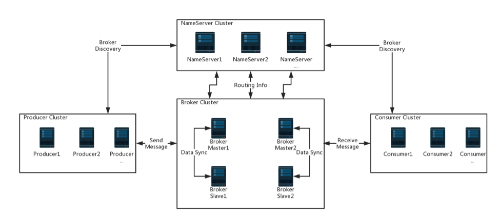

## Apache RocketMQ

> Apache RocketMQ™ is an open source distributed messaging and streaming data platform.
> 分布式消息中间件
> 
> 内容来源： http://rocketmq.apache.org/

### 特点
* Low Latency 低延时
    
    More than 99.6% response latency within 1 millisecond under high pressure.

* Finance Oriented
    
    High availability with tracking and auditing features.

* Industry Sustainable
    
    Trillion-level message capacity guaranteed.

* Vendor Neutral

    A new open distributed messaging and streaming standard since latest 4.1 version.

* BigData Friendly

    Batch transferring with versatile integration for flooding throughput.

* Massive Accumulation
    
    Given sufficient disk space, accumulate messages without performance loss.

### RocketMQ vs. ActiveMQ vs. Kafka

(is written by the RocketMQ team. December 17, 2016)

Messaging Product | Client SDK | Protocol and Specification | Ordered Message | Scheduled Message | Batched Message | BroadCast Message | Message Filter | Server Triggered Redelivery | Message Storage | Message Retroactive | Message Priority | High Availability and Failover | Message Track | Configuration | Management and Operation Tools
---|---|---|---|---|---|---|---|---|---|---|---|---|---|---|---
ActiveMQ | Java, .NET, C++ etc. | Push model, support OpenWire, STOMP, AMQP, MQTT, JMS | Exclusive Consumer or Exclusive Queues can ensure ordering | Supported | Not Supported | Supported | Supported | Not Supported | Supports very fast persistence using JDBC along with a high performance journal，such as levelDB, kahaDB | Supported | Supported | Supported, depending on storage,if using kahadb it requires a ZooKeeper server | Not Supported | The default configuration is low level, user need to optimize the configuration parameters | Supported
Kafka | Java, Scala etc. | Pull model, support TCP | Ensure ordering of messages within a partition | Not Supported | Supported, with async producer | Not Supported | Supported, you can use Kafka Streams to filter messages | Not Supported | High performance file storage | Supported offset indicate | Not Supported | Supported, requires a ZooKeeper server | Not Supported | Kafka uses key-value pairs format for configuration. These values can be supplied either from a file or programmatically. | Supported, use terminal command to expose core metrics
RocketMQ | Java, C++, Go | Pull model, support TCP, JMS, OpenMessaging | Ensure strict ordering of messages,and can scale out gracefully | Supported | Supported, with sync mode to avoid message loss | Supported | Supported, property filter expressions based on SQL92 | Supported | High performance and low latency file storage | Supported timestamp and offset two indicates | Not Supported | Supported, Master-Slave model, without another kit | Supported | Work out of box,user only need to pay attention to a few configurations | Supported, rich web and terminal command to expose core metrics

### 架构图

### 已发布版本

* 4.5.2    Released Aug 02, 2019
* 4.5.0    Released March 29, 2019
* 4.4.0    Released January 17, 2019
* 4.3.0    Released July 24, 2018
* 4.2.0    Released December 13, 2017
* 4.0.0-incubating    Released January 24, 2017
