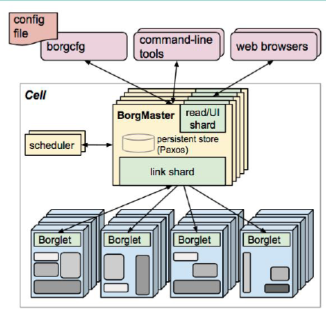
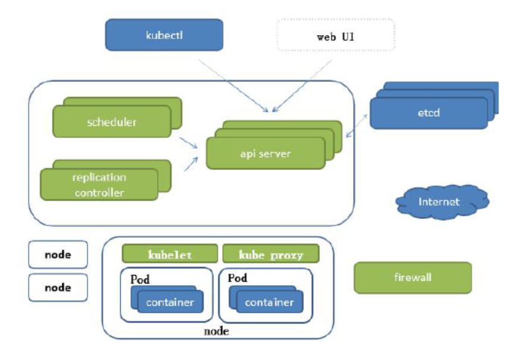
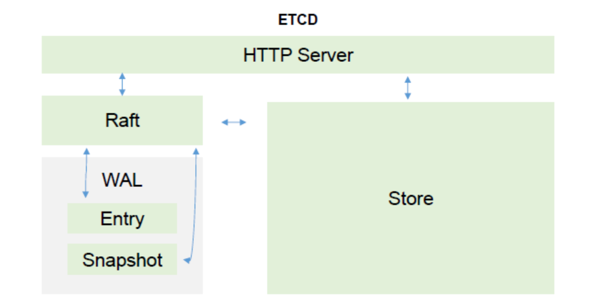

## Kubernetes 组件

> Kubernetes是Google Borg 调度系统的Go语言重构版。

### 目录
* [Borg组件说明](#Borg组件说明)
* [K8S结构说明/架构](#K8S结构说明/架构)
    * [网络结构](#网络结构)
    * [组件结构](#组件结构)
* [K8S中一些关键字解释](#K8S中一些关键字解释)

### Borg组件说明

* BorgMaster ： 负责请求的分发，是整个集群的大脑。为了防止BorgMaster单节点故障，高可用集群节点个数 >= 3 奇数。
* Borglet ： 提供服务。
* 支持的访问方式 ： web browsers 浏览器， command-line tools 命令行， config file - borgcfg 配置文件读取。 
* scheduler 调度器 

流程：
1. 访问/接入 BorgMaster，处理请求，分发（link shard）到不同的Borglet节点运行。
2. 调度器scheduler把数据写入数据库Paxos存储。
3. Borglet 监听数据库Paxos，消费请求，处理请求。

### K8S结构说明/架构

#### 网络结构
#### 组件结构
### K8S中一些关键字解释