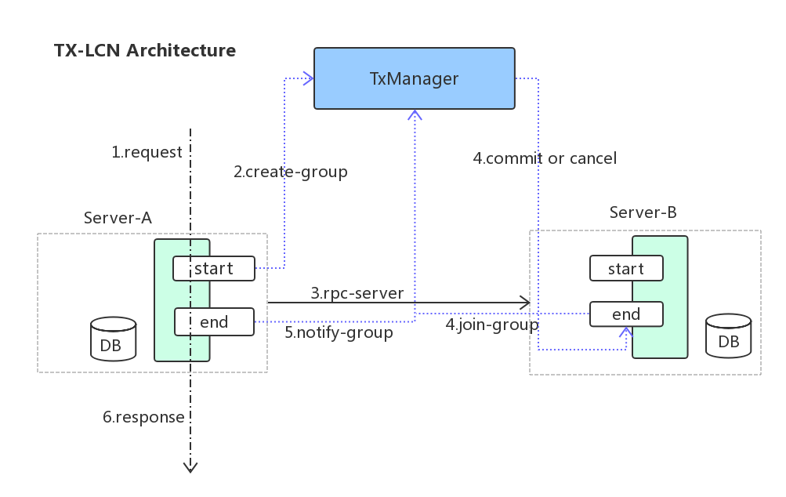

## TX-LCN分布式事务框架

网站： http://www.txlcn.org/zh-cn/

用户文档： http://www.txlcn.org/zh-cn/docs/preface.html

GitHub： https://github.com/codingapi/tx-lcn

Demo： https://github.com/codingapi/springcloud-lcn-demo

> LCN并不生产事务，LCN只是本地事务的协调工
>
> 参考： 官网，https://blog.csdn.net/ningjiebing/article/details/89948050

### 目录
* [是什么？](#是什么？)
* [是否开源](#是否开源)
* [架构](#架构)
* [功能特性](#功能特性)
* [事务模式](#事务模式)
* [主要原理](#主要原理)

### 是什么？

高性能的分布式事务框架。

LCN分布式事务框架其本身并不创建事务，而是基于对本地事务的协调从而达到事务一致性的效果。

兼容dubbo、springcloud框架，支持RPC框架拓展，支持各种ORM框架、NoSQL、负载均衡、事务补偿

### 是否开源

开源

### 架构

### 功能特性

* 一致性

    通过TxManager协调控制与事务补偿机制确保数据一致性

* 高可用

    项目模块不仅可高可用部署，事务协调器也可集群化部署

* 易用性

    仅需要在业务方法上添加@TxTransaction注解即可

* 扩展性

    支持各种RPC框架扩展，支持通讯协议与事务模式扩展

### 事务模式
LCN5.0.2有3种模式，分别是LCN模式，TCC模式，TXC模式。

* LCN模式

    LCN模式是通过代理Connection的方式实现对本地事务的操作，然后在由TxManager统一协调控制事务。当本地事务提交回滚或者关闭连接时将会执行假操作，该代理的连接将由LCN连接池管理。
    
    特点：

    * 该模式对代码的嵌入性为低。
    * 该模式仅限于本地存在连接对象且可通过连接对象控制事务的模块。
    * 该模式下的事务提交与回滚是由本地事务方控制，对于数据一致性上有较高的保障。
    * 该模式缺陷在于代理的连接需要随事务发起方一共释放连接，增加了连接占用的时间。
 
* TCC模式

    TCC事务机制相对于传统事务机制（X/Open XA Two-Phase-Commit），其特征在于它不依赖资源管理器(RM)对XA的支持，而是通过对（由业务系统提供的）业务逻辑的调度来实现分布式事务。主要由三步操作，Try: 尝试执行业务、 Confirm:确认执行业务、 Cancel: 取消执行业务。

    特点：

    * 该模式对代码的嵌入性高，要求每个业务需要写三种步骤的操作。
    * 该模式对有无本地事务控制都可以支持使用面广。
    * 数据一致性控制几乎完全由开发者控制，对业务开发难度要求高。
 
* TXC模式

    TXC模式命名来源于淘宝，实现原理是在执行SQL之前，先查询SQL的影响数据，然后保存执行的SQL快走信息和创建锁。当需要回滚的时候就采用这些记录数据回滚数据库，目前锁实现依赖redis分布式锁控制。

    特点：

    * 该模式同样对代码的嵌入性低。
    * 该模式仅限于对支持SQL方式的模块支持。
    * 该模式由于每次执行SQL之前需要先查询影响数据，因此相比LCN模式消耗资源与时间要多。
    * 该模式不会占用数据库的连接资源。

### 主要原理

核心步骤：

1. 创建事务组

    在事务发起方开始执行业务代码之前先调用TxManager创建事务组对象，然后拿到事务标示GroupId的过程。

2. 添加事务组

    参与方在执行完业务方法以后，将该模块的事务信息添加通知给TxManager的操作。
    
3. 关闭事务组

    在发起方执行完业务代码以后，将发起方执行结果状态通知给TxManager的动作。当执行完关闭事务组的方法以后，TxManager将根据事务组信息来通知相应的参与模块提交或回滚事务。

