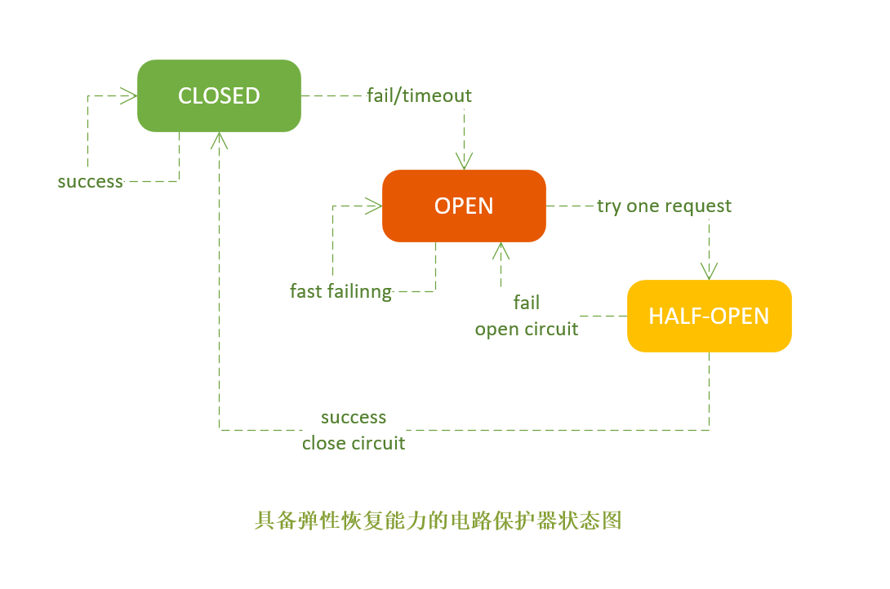

## 断路器

> 微服务之间有着错综复杂的依赖关系，服务往往不是百分之百可靠，可能会出现错误或延迟。 那么就需要对可能出现的故障进行容错和隔离，否则就会应用可能被故障拖垮瘫痪。
>
> 分布式容错模式： 断路器

### 目录
* [电路熔断器模式(Circuit Breaker Patten)](#电路熔断器模式)
* [舱壁隔离模式(Bulkhead Isolation Pattern)](#舱壁隔离模式)

### 电路熔断器模式

原理： 在分布式系统中应用电路熔断器模式后，当目标服务慢或者大量超时，调用方能够主动熔断，以防止服务被进一步拖垮；如果情况又好转了，电路又能自动恢复，这就是所谓的弹性容错，系统有自恢复能力。

* 正常状态下，电路处于关闭状态(Closed)
* 如果调用持续出错或者超时，电路被打开进入熔断状态(Open)，后续一段时间内的所有调用都会被拒绝(Fail Fast)
* 一段时间以后，保护器会尝试进入半熔断状态(Half-Open)，允许少量请求进来尝试，如果调用仍然失败，则回到熔断状态，如果调用成功，则回到电路闭合状态。

### 舱壁隔离模式

该模式像舱壁一样对资源或失败单元进行隔离，如果一个船舱破了进水，只损失一个船舱，其它船舱可以不受影响 。
线程隔离(Thread Isolation)就是舱壁隔离模式的一个例子，假定一个应用程序A调用了Svc1/Svc2/Svc3三个服务，且部署A的容器一共有120个工作线程，采用线程隔离机制，可以给对Svc1/Svc2/Svc3的调用各分配40个线程，当Svc2慢了，给Svc2分配的40个线程因慢而阻塞并最终耗尽，线程隔离可以保证给Svc1/Svc3分配的80个线程可以不受影响，如果没有这种隔离机制，当Svc2慢的时候，120个工作线程会很快全部被对Svc2的调用吃光，整个应用程序会全部慢下来。

* 限流(Rate Limiting/Load Shedder)，服务总有容量限制，没有限流机制的服务很容易在突发流量(秒杀，双十一)时被冲垮。限流通常指对服务限定并发访问量，比如单位时间只允许100个并发调用，对超过这个限制的请求要拒绝并回退。
* 回退(fallback)，在熔断或者限流发生的时候，应用程序的后续处理逻辑是什么？回退是系统的弹性恢复能力，常见的处理策略有，直接抛出异常，也称快速失败(Fail Fast)，也可以返回空值或缺省值，还可以返回备份数据，如果主服务熔断了，可以从备份服务获取数据。

